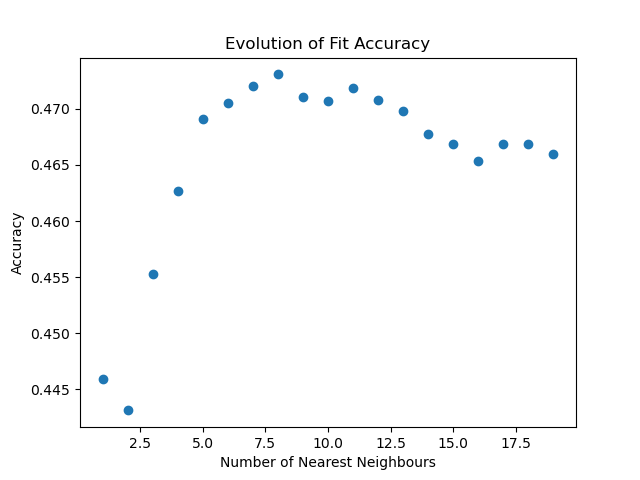

# spotify-ml
Predict the release year of a song based on its artists and popularity.  There are ~170,000 tracks, with release dates ranging from 1928 to 2020. The dataset, gathered using the Spotify API, is provided by the Kaggle user Yamac Eren Ay under a Community Data License Agreement.

## Implementation
The model is a K-Nearest Neighbours (KNN) clustering algorithm. The number of neighbours used in the model was scanned for validation accuracy, which reaches a maximum at ~7-10 (7 in this iteration, as show below).

## Advantages
The primary advantage of this model is its size. For example, a simple hashmap that only has one entry for each of the ~33,000 unique artists in the dataset would require 1.3 MB. Accounting for the popularity as well requires 5.2 MB. Meanwhile, the KNN is only 48 bytes, an improvement of five orders of magnitude, and this difference becomes even more dramatic with larger datasets.

Furthermore, it is significantly faster to train, requiring only training time on the order of ~100ms, compared to a deep learning neural network, which can take minutes or hours to train.

